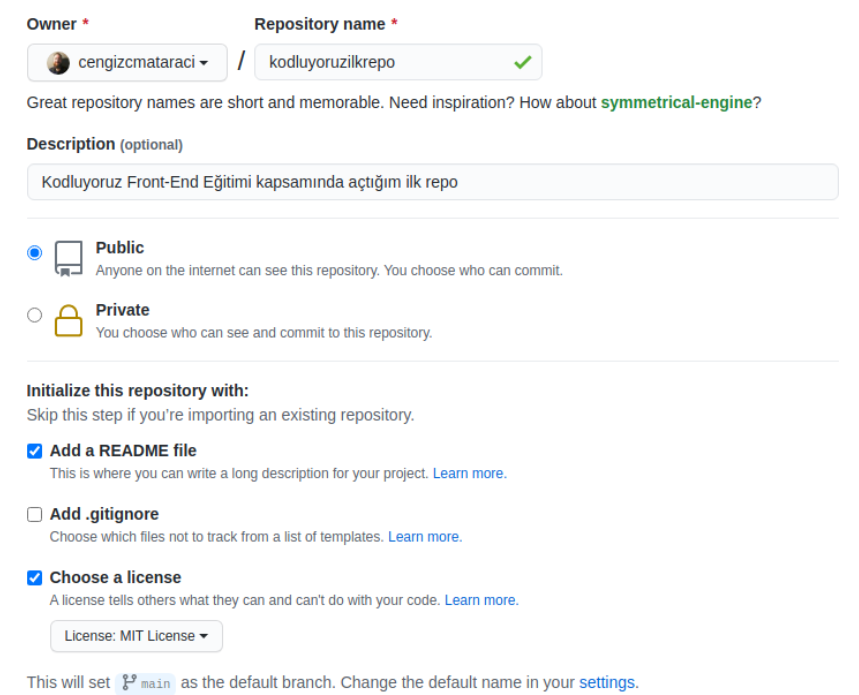

# Kodluyoruz İlk Repo 

Bu repo [Kodluyoruz](https://kodluyoruz.org) Front-End Eğitiminde oluşturduğumuz ilk repo. İçerisinde bir adet README dosyası, bir adet de index.html barındırıyor.



# Installation 
Öncelikle projeyi clonlayın. 

```
git clone https://github.com/miracersoz/kodluyoruzilkrepo.git
```

# Usage 

Projeyi klonladıktan sonra Visiual Studia Code programında açınız.

Linux için:

```
cd kodluyoruzilkrepo
code .
```

# Contributing

Pull requestler kabul edilir. Büyük değişiklikler için, lütfen önceney, değiştirmek istediğinizi tartışmak için bir konu açınız.

# License

[MIT](https://choosealicense.com/licenses/mit/)
